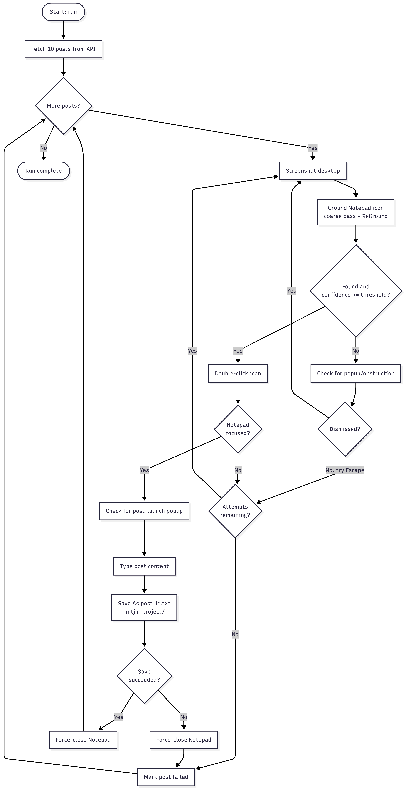

# Design Document: Vision-Based Desktop Automation with Grounding

## Assumptions
- Target: Windows 11, single monitor, 1920x1080
- Notepad desktop shortcut exists before script runs
- Access to jsonplaceholder.typicode.com, no auth required
- "Close Notepad" = save first, then close via standard window close
- No concurrent user interaction with desktop during run
- Posts saved to `Desktop/tjm-project`
- Icon position not assumed stable — re-ground before every launch
- Confidence threshold: 0.5

## System Design

Each iteration re-screenshots and re-grounds from scratch rather than caching icon location, since position cannot be assumed stable between attempts.

## Grounding Strategy & Why This Method

The reference paper (Li et al., ScreenSpot-Pro) benchmarks four grounding strategies on the same base model (OS-Atlas-7B):

| Method | Accuracy | Approach |
|---|---|---|
| Single-pass direct | 18.9% | One VLM call, no refinement |
| Iterative Focusing | 31.0%  | Grounds on the full screen, splits the screenshot into a fixed 2x2 grid, keeps the quadrant containing the prediction, repeats
| Iterative Narrowing | 31.9% | Same iterative procedure, but crops are centered on the prediction each round (half the prior width/height) rather than a fixed grid |
| **ReGround (chosen)** | **40.2%** | One crop around the coarse prediction, one refinement pass |
| ScreenSeekeR | 48.1% | Planner (GPT-4o) decomposes instruction into ranked regions, then cascaded recursive search with scoring |

**ReGround Over Other Non-Planner Methods:** ReGround scores higher (40.2% vs 31.9%) with fewer model calls and repeating the cropping and regrounding on multiple rounds. Better on both accuracy and cost for this particular project.

**ReGround over ScreenSeekeR:** ScreenSeekeR's ~8-point gain requires a much heavier pipeline (separate planner call, cascaded search, scoring, non-max suppression, 10-20+ calls per grounding operation vs. ReGround's 1-2). For a desktop icon, that would be much added cost/latency.

**VLM grounding over template-matching/OCR:** the requirement to locate icons "without a pre-supplied image or exact text" rules out both a template matching method which needs a reference image, and OCR method which needs a visible/known label. VLM grounding needs neither.

**Implementation:** coarse pass (full screenshot + natural-language instruction) → if confident, crop 1024×1024 around the result (per the paper's ablation optimum for this model class) → refine → map crop-local coordinates back to screen space. Screenshots are downscaled to the API's 1568px max dimension before sending; returned coordinates are scaled back up.

**Limitation:** ReGround gets one refinement attempt, not multiple rounds like Iterative Narrowing. If the coarse pass is far off, the target can fall outside even a correctly-centered crop with no recovery round. Mitigated by confidence gating: a low-confidence refinement falls back to the coarse result rather than using a bad crop.

## Popup / Obstruction Recovery

The same grounding call used for icon detection is reused to detect unexpected interruptions, with no prior knowledge of their appearance required. A context-specific instruction (e.g. "report any dialog other than the expected Notepad window") is sent through `ground_element`. A confidently-located dismiss control is clicked; otherwise Escape is tried as a generic fallback, and detection retries with a fresh screenshot. This layer is application-agnostic (`make_context(app_name, phase)`); only the downstream typing/save workflow is Notepad-specific, matching the task as scoped.

## Performance

Full 10-post run: ~176s total (~17.6s/post). Per post: 1-2 grounding API calls (coarse + optional ReGround), launch/focus confirmation, typing, Save As round trip, close. Fixed UI settle delays contribute ~2.5s/post regardless of API latency; the remainder is model/network latency, not locally compute-bound.

**Optimization strategies:**
- Skip ReGround when coarse confidence is already very high (>0.9), saving a round trip on the easy majority of cases
- Replace remaining blind `sleep()` calls with polling/verification (already done for save and close)
- Cache last-known icon location with a cheap confirm-only check before trusting it. Not implemented by default, since it conflicts with the "position not stable" assumption; would need to be opt-in
- Crop the screenshot to the desktop region before sending, reducing payload further
- Parallelization doesn't apply. Workflow is a strictly sequential single-window UI automation

## Error Handling

- **Low confidence** → treated as not-found, retried rather than acted on
- **Wrong-target click** → verified via foreground-window confirmation after click; retried up to `MAX_GROUNDING_ATTEMPTS` if unconfirmed
- **API fetch failure** → caught, logged, run aborts cleanly (no partial-data proceeding)
- **Unexpected popups** → generic detection + dismiss/Escape recovery (see above)
- **Save failure** → Notepad closed normally, post marked failed, run continues with remaining posts
- **Malformed model output** → the model doesn't always follow the "JSON only" instruction exactly; parsing falls back to regex-extracting the first `{...}` block rather than failing on any prose the model adds
- **Stray windows** → a launch that opens a window which never becomes confirmed-active is cleaned up before retrying, preventing orphaned-window accumulation

## When Detection Would Fail, and Improvements

1. **Fully occluded target, no dismissible control found, doesn't respond to Escape**  Genuine blind spot. *Improve:* add further generic-clear attempts (Win+D, Alt+Tab) and verify via a follow-up screenshot rather than assuming the keypress worked.
2. **Rapid, stacking interruptions outpacing the detect-dismiss cycle** Verified via a chaos-test harness injecting real dialogs at randomized intervals; confirmed this is a real limit, not just theoretical. Explicitly out of scope for the assignment's stated scenario (occasional interruptions), not a hidden gap.
3. **Miscalibrated confidence**  A self-reported score isn't independent verification. *Improve:* extend the existing foreground-confirmation check to more steps as a behavioral cross-check.
4. **Multiple visually similar candidates** The current approach returns one best guess with no disambiguation. *Improve:* the multi-icon enumeration bonus (return all candidates, then select) would address this directly.

## Scaling to Other Applications

`grounding.py` and `popup.py` are already application-agnostic. Verified via a standalone demo (`demo_grounding.py`) that located arbitrary desktop targets (e.g. Recycle Bin) with zero code changes, only a different instruction string. Extending to a new application would require: a new workflow module for that app's specific interaction sequence (a browser's tabs/close semantics differ from Notepad's Save As flow), and action primitives generalized beyond the single-document-window assumption. Scaling to multi-step tasks (not just single-icon launch) would require replacing the fixed screenshot→ground→act loop with a planning layer, in the spirit of ScreenSeekeR which is a tradeoff worth revisiting once targets are harder to locate or tasks require multi-step reasoning.

## What I'd Do Differently With More Time

- Implement the multi-icon enumeration feature
- Build a small labeled benchmark (known ground-truth icon positions, including obstructed cases) for quantitative accuracy rather than anecdotal pass/fail
- Separate obstruction-classification from icon-grounding prompts so each can be tuned independently
- Add a mocked end-to-end test (scripted fake VLM responses) to catch orchestration bugs like the orphaned-window issue in CI, not just via manual chaos testing